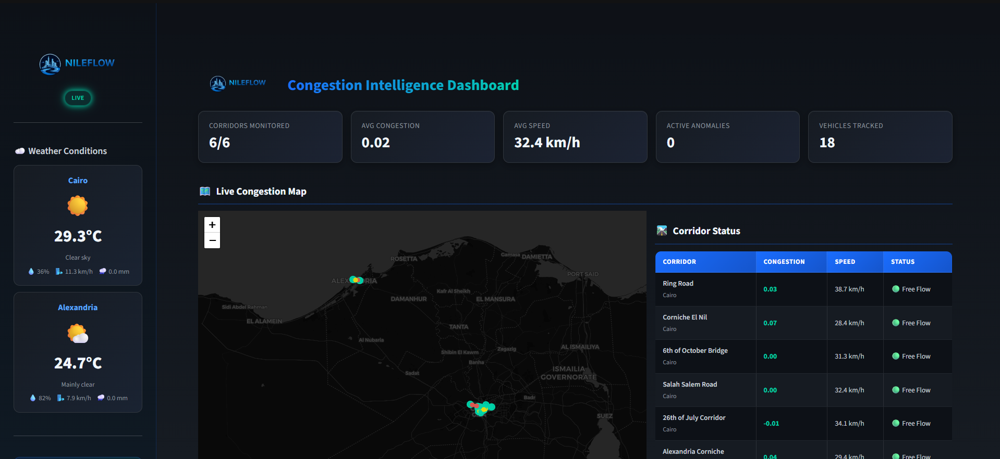
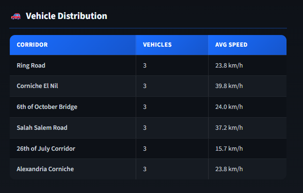
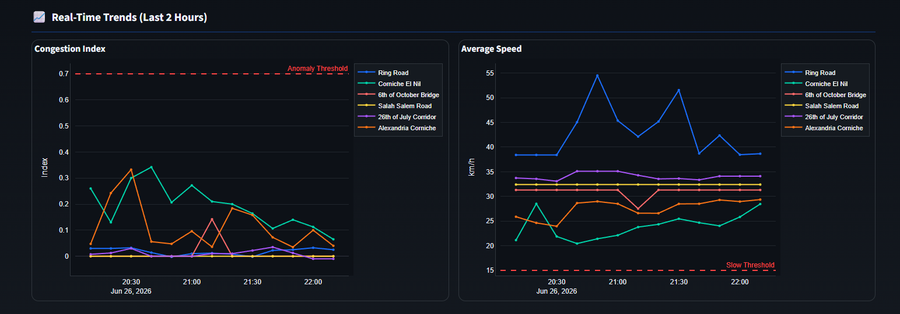
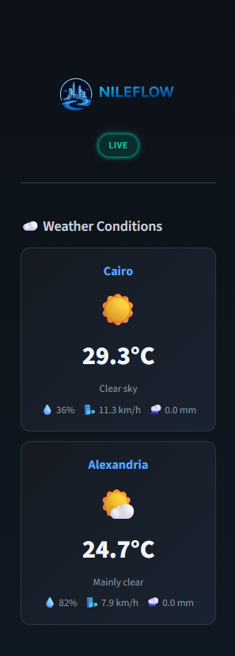
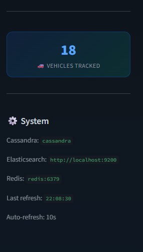

<!-- Header Banner -->
<p align="center">
  
</p>

<h1 align="center">
  NileFlow
</h1>

<p align="center">
  <strong>Real-Time Traffic & Transit Congestion Intelligence Platform for Greater Cairo and Alexandria</strong>
</p>

<p align="center">
  <a href="#-about"></a>
  <a href="#-tech-stack"></a>
  <a href="#-tech-stack"></a>
  <a href="#-tech-stack"></a>
  <a href="#-tech-stack"></a>
  <a href="LICENSE"></a>
</p>

<p align="center">
  <a href="#-about">About</a> &bull;
  <a href="#-problem-statement">Problem</a> &bull;
  <a href="#-solution">Solution</a> &bull;
  <a href="#%EF%B8%8F-architecture">Architecture</a> &bull;
  <a href="#-tech-stack">Tech Stack</a> &bull;
  <a href="#-database-schemas">Schemas</a> &bull;
  <a href="#-getting-started">Getting Started</a> &bull;
  <a href="#-dashboard">Dashboard</a> &bull;
  <a href="#-team">Team</a>
</p>

---

## About

**NileFlow** tells you, in real time, whether your commute through Cairo or Alexandria is about to be miserable — and *why*.

We stream live traffic, transit, and weather data through Kafka, process it with Spark Structured Streaming to compute a live congestion index, detect anomalies, and push alerts to Discord — while showing everything on a live map dashboard.

> Built as a capstone project for the **Digital Egypt Pioneers Initiative (DEPI)** — Data Engineering Track.

---

## Problem Statement

Greater Cairo's transportation network — a patchwork of formal metro and bus lines alongside informal microbus routes — has **no unified real-time information layer**.

- No public, data-driven view shows where the network is congested *right now*
- Traffic congestion is one of the most cited daily-life pain points in Egypt
- No open real-time analytics system combines **transit + traffic + weather** to explain how bad it is, where, and why

Commuters, city planners, and logistics companies are all flying blind.

---

## Solution

NileFlow bridges this gap by building a **real-time congestion and transit-delay monitoring platform** that:

- **Ingests** live traffic conditions, simulated vehicle positions, and weather observations through Kafka
- **Processes** streams using Spark Structured Streaming — computing a rolling congestion index per corridor and detecting anomalies (sudden slowdowns, abnormal transit delays)
- **Stores** results across PostgreSQL, Cassandra, and Elasticsearch depending on data type
- **Visualizes** insights on a live, map-based Streamlit dashboard
- **Alerts** via Discord webhook when severe congestion events are detected

---

## Architecture

<p align="center">
  
</p>

### Data Flow

```
Data Sources ──► Kafka Topics ──► Spark Structured Streaming ──► Storage Layer ──► Dashboard + Alerts
                                                                      │
                                                            ┌─────────┼─────────┐
                                                        PostgreSQL  Cassandra  Elasticsearch
```

1. **Kafka Producers** poll live APIs (TomTom traffic, Open-Meteo weather) and generate simulated vehicle GPS position events
2. **Spark Structured Streaming** consumes all three Kafka topics, applies windowed aggregations and watermarking
3. **Congestion Index** is computed per corridor (current travel time vs. free-flow baseline)
4. **Anomaly Detection** flags severe congestion (index > 0.7) or low-speed events (< 15 km/h)
5. **Storage Layer** writes reference data to PostgreSQL, time-series metrics to Cassandra, and alert logs to Elasticsearch
6. **Redis Pub/Sub** fans out detected anomalies to alert consumers
7. **Discord Webhook** posts formatted real-time congestion alerts with severity levels
8. **Streamlit Dashboard** renders a live congestion map, time-series charts, corridor status, weather sidebar, and alert feed
9. **Airflow DAGs** handle daily reference data refresh, baseline recalculation, and data quality checks

### Design Decisions

| Decision | Rationale |
|----------|-----------|
| **Polyglot persistence** (3 databases) | Each data type gets the storage engine optimized for its access pattern: relational lookups (Postgres), high-throughput time-series writes (Cassandra), full-text search on alerts (Elasticsearch) |
| **Simulated vehicle positions** instead of real GTFS-realtime | Transport for Cairo GTFS-realtime feeds are unreliable; simulation provides the same streaming architecture value while ensuring a working demo |
| **Redis Pub/Sub** for alert fan-out | Decouples anomaly detection from notification delivery; multiple consumers (Discord, dashboard) can subscribe independently |
| **Tumbling windows** in Spark | 10-minute windows for traffic, 5-minute for vehicle positions — balances freshness with statistical significance |
| **30-day TTL** on Cassandra tables | Prevents unbounded storage growth; historical analysis uses Airflow-computed baselines in Postgres |

---

## Tech Stack

<table>
  <tr>
    <th>Component</th>
    <th>Technology</th>
    <th>Purpose</th>
  </tr>
  <tr>
    <td><strong>Language</strong></td>
    <td></td>
    <td>All producers, Spark jobs, dashboard, and orchestration</td>
  </tr>
  <tr>
    <td><strong>Streaming</strong></td>
    <td></td>
    <td>Event streaming backbone — 3 topics for traffic, weather, and vehicle position events</td>
  </tr>
  <tr>
    <td><strong>Stream Processing</strong></td>
    <td></td>
    <td>Structured Streaming — windowed aggregations, watermarking, congestion index, anomaly detection</td>
  </tr>
  <tr>
    <td><strong>Orchestration</strong></td>
    <td></td>
    <td>Daily reference data refresh, baseline recalculation, data quality checks</td>
  </tr>
  <tr>
    <td><strong>Relational DB</strong></td>
    <td></td>
    <td>Reference data — corridors, districts, routes, stops, congestion baselines</td>
  </tr>
  <tr>
    <td><strong>NoSQL / Time-Series</strong></td>
    <td></td>
    <td>High-throughput time-series storage for congestion and weather metrics (30-day TTL)</td>
  </tr>
  <tr>
    <td><strong>Search & Indexing</strong></td>
    <td></td>
    <td>Searchable alert history and pipeline event logs</td>
  </tr>
  <tr>
    <td><strong>Cache / Pub-Sub</strong></td>
    <td></td>
    <td>Real-time alert fan-out via pub/sub + vehicle position cache for dashboard</td>
  </tr>
  <tr>
    <td><strong>Alerts</strong></td>
    <td></td>
    <td>Webhook-based real-time congestion alerts with severity-coded embeds</td>
  </tr>
  <tr>
    <td><strong>Dashboard</strong></td>
    <td></td>
    <td>Live congestion map (Folium), time-series charts (Plotly), corridor status, alert feed</td>
  </tr>
  <tr>
    <td><strong>Containerization</strong></td>
    <td></td>
    <td>Docker Compose runs the entire stack (18 services) with one command</td>
  </tr>
  <tr>
    <td><strong>Data Sources</strong></td>
    <td>
      
      
    </td>
    <td>Live traffic/routing data per corridor, weather observations for Cairo & Alexandria</td>
  </tr>
</table>

---

## Project Objectives

- Build a real-time, event-driven data pipeline using Apache Kafka
- Ingest live traffic and weather data from public APIs
- Simulate real-time vehicle GPS position events along monitored corridors
- Process streaming data with Spark Structured Streaming, including time-window aggregations and watermarking
- Compute a real-time congestion index and detect anomalies (delays, slowdowns)
- Design a multi-database storage layer (PostgreSQL, Cassandra, Elasticsearch)
- Automate batch refresh and data quality checks using Apache Airflow
- Deliver real-time alerts through Discord webhook integration
- Build a live, map-based dashboard for congestion visualization
- Containerize the entire platform with Docker Compose for one-command deployment

---

## Database Schemas

### PostgreSQL — Reference Data

```sql
-- nileflow.corridors
corridor_id  VARCHAR(50) PK    -- e.g. "ring_road"
name         VARCHAR(150)      -- "Ring Road"
city         VARCHAR(50)       -- "Cairo" | "Alexandria"
start_lat    DOUBLE PRECISION  -- corridor start point
start_lon    DOUBLE PRECISION
end_lat      DOUBLE PRECISION  -- corridor end point
end_lon      DOUBLE PRECISION
distance_km  DOUBLE PRECISION

-- nileflow.congestion_baselines (updated daily by Airflow)
corridor_id  VARCHAR(50) FK    -- references corridors
day_of_week  INTEGER           -- 0=Monday .. 6=Sunday
hour_of_day  INTEGER           -- 0..23
avg_travel_time_sec  DOUBLE PRECISION
sample_count INTEGER
PK: (corridor_id, day_of_week, hour_of_day)

-- Also: districts, routes, stops tables for transit reference data
```

### Cassandra — Time-Series Metrics

```sql
-- nileflow.congestion_metrics
-- Partition key: corridor_id | Clustering: event_time DESC | TTL: 30 days
corridor_id      TEXT
event_time       TIMESTAMP
travel_time_sec  INT
free_flow_sec    INT
congestion_index DOUBLE       -- 0.0 (free flow) to 2.0+ (gridlock)
speed_kmh        DOUBLE
is_anomaly       BOOLEAN

-- nileflow.weather_metrics
-- Partition key: location | Clustering: event_time DESC | TTL: 30 days
location         TEXT         -- "Cairo" | "Alexandria"
event_time       TIMESTAMP
temperature_c    DOUBLE
humidity_pct     DOUBLE
precipitation_mm DOUBLE
wind_speed_kmh   DOUBLE
weather_code     INT          -- WMO weather code
```

### Elasticsearch — Alert & Event Logs

```json
// congestion_alerts index
{
  "corridor_id":      "keyword",
  "alert_type":       "keyword",    // "high_congestion" | "low_speed"
  "severity":         "keyword",    // "warning" | "critical"
  "congestion_index": "double",
  "speed_kmh":        "double",
  "message":          "text",
  "event_time":       "date",
  "created_at":       "date"
}

// pipeline_events index — general system events
{
  "event_type": "keyword",
  "source":     "keyword",
  "message":    "text",
  "event_time": "date"
}
```

---

## Dashboard

The Streamlit dashboard provides real-time visibility into traffic conditions across Cairo and Alexandria.

<p align="center">
  
</p>

**Features:**
- **Live Congestion Map** — Folium map with color-coded corridor polylines (green/yellow/orange/red by congestion level) and live vehicle markers
- **Key Metrics** — Corridors monitored, average congestion index, average speed, active anomalies, vehicles tracked
- **Corridor Status Table** — Real-time congestion index, speed, and status per corridor
- **Time-Series Charts** — Plotly charts showing congestion index and speed trends over the last 2 hours
- **Alert Feed** — Latest anomaly alerts from Elasticsearch
- **Weather Sidebar** — Current temperature and conditions for Cairo and Alexandria (from Cassandra)
- **Auto-Refresh** — Dashboard refreshes every 10 seconds

<details>
<summary>More dashboard screenshots</summary>
<br/>




</details>

---

## Getting Started

### Prerequisites

- [Docker](https://docs.docker.com/get-docker/) & [Docker Compose](https://docs.docker.com/compose/install/) (v2.0+)
- At least **8 GB RAM** allocated to Docker (Cassandra + Spark + Elasticsearch are memory-hungry)
- A [TomTom API key](https://developer.tomtom.com) (free tier — no credit card required)
- (Optional) A [Discord webhook URL](https://support.discord.com/hc/en-us/articles/228383668) for real-time alerts

### Quick Start

```bash
# 1. Clone the repository
git clone https://github.com/mohamed-mahmoud-de/NileFlow.git
cd NileFlow

# 2. Create your .env file
cp .env.example .env
# Edit .env and add your TOMTOM_API_KEY and DISCORD_WEBHOOK_URL

# 3. Start the entire platform
docker-compose up -d

# 4. Verify all services are running
docker-compose ps
```

That's it. The entire platform starts automatically:
- Kafka topics are auto-created when producers first publish
- Cassandra keyspace and tables are initialized by the `cassandra-init` service
- Elasticsearch indices are created by the `elasticsearch-init` service
- PostgreSQL schema and seed data load on first container start
- All three producers start streaming data immediately

### Access Points

| Service | URL | Credentials |
|---------|-----|-------------|
| **Streamlit Dashboard** | http://localhost:8501 | — |
| **Airflow UI** | http://localhost:8080 | admin / admin |
| **Spark Master UI** | http://localhost:8081 | — |
| **Elasticsearch** | http://localhost:9200 | — |
| **Kafka** | localhost:29092 (host) / kafka:9092 (container) | — |
| **PostgreSQL** | localhost:5432 | nileflow / nileflow_dev |
| **Cassandra** | localhost:9042 | — |
| **Redis** | localhost:6379 | — |

### Running Spark Streaming Jobs

After the infrastructure is up, submit the Spark processors:

```bash
# Traffic processor (congestion index + anomaly detection)
docker exec nileflow-spark-master /opt/spark/bin/spark-submit \
  --master spark://spark-master:7077 \
  --packages org.apache.spark:spark-sql-kafka-0-10_2.12:3.5.6,com.datastax.spark:spark-cassandra-connector_2.12:3.5.1 \
  /opt/nileflow/spark/streaming/traffic_processor.py

# Weather processor
docker exec nileflow-spark-master /opt/spark/bin/spark-submit \
  --master spark://spark-master:7077 \
  --packages org.apache.spark:spark-sql-kafka-0-10_2.12:3.5.6,com.datastax.spark:spark-cassandra-connector_2.12:3.5.1 \
  /opt/nileflow/spark/streaming/weather_processor.py

# Vehicle positions processor
docker exec nileflow-spark-master /opt/spark/bin/spark-submit \
  --master spark://spark-master:7077 \
  --packages org.apache.spark:spark-sql-kafka-0-10_2.12:3.5.6,com.datastax.spark:spark-cassandra-connector_2.12:3.5.1 \
  /opt/nileflow/spark/streaming/vehicle_positions_processor.py
```

### Stopping the Platform

```bash
# Stop all services
docker-compose down

# Stop and remove all data volumes (clean reset)
docker-compose down -v
```

---

## Kafka Topics

| Topic | Partitions | Producer | Content |
|-------|-----------|----------|---------|
| `traffic_events` | 3 | Traffic Producer | Congestion index, speed, travel time per corridor from TomTom API |
| `weather_events` | 1 | Weather Producer | Temperature, humidity, precipitation, wind speed from Open-Meteo |
| `vehicle_position_events` | 3 | Vehicle Positions Producer | Simulated GPS pings (lat, lon, speed, heading) for 18 vehicles |

---

## Airflow DAGs

| DAG | Schedule | Purpose |
|-----|----------|---------|
| `nileflow_daily_data_refresh_baseline_recalculation` | `@daily` | Upserts corridor reference data into PostgreSQL, then recalculates rolling congestion baselines from the last 7 days of Cassandra metrics |
| `nileflow_data_quality_pipeline_freshness` | Every 30 min | Checks Kafka topic freshness, Cassandra data recency, and Elasticsearch cluster health |

---

## Key Corridors Monitored

| Corridor | City | Distance |
|----------|------|----------|
| Ring Road | Cairo | 18.5 km |
| Corniche El Nil | Cairo | 5.2 km |
| 6th of October Bridge | Cairo | 3.8 km |
| Salah Salem Road | Cairo | 6.1 km |
| 26th of July Corridor | Cairo | 9.7 km |
| Alexandria Corniche | Alexandria | 7.3 km |

---

## Project Structure

```
NileFlow/
├── config/
│   └── settings.py             # Central configuration (env-based with defaults)
├── producers/
│   ├── traffic/producer.py     # TomTom API → Kafka (traffic_events)
│   ├── weather/producer.py     # Open-Meteo API → Kafka (weather_events)
│   └── vehicle_positions/      # Simulated GPS pings → Kafka (vehicle_position_events)
│       └── producer.py
├── spark/
│   └── streaming/
│       ├── traffic_processor.py          # Congestion index + anomaly detection
│       ├── weather_processor.py          # Weather data cleaning + Cassandra write
│       └── vehicle_positions_processor.py # Speed aggregation per corridor
├── storage/
│   ├── postgres/init/
│   │   ├── 001_create_schema.sql   # Reference tables (auto-runs on first start)
│   │   └── 002_seed_corridors.sql  # Corridor seed data
│   ├── cassandra/init/
│   │   └── create_keyspace.cql     # Keyspace + tables (auto-init via docker-compose)
│   └── elasticsearch/init/
│       └── create_indices.sh       # Index templates (auto-init via docker-compose)
├── airflow/
│   └── dags/
│       ├── daily_refresh_dag.py    # Corridor upsert + baseline recalculation
│       └── data_quality_dag.py     # Kafka/Cassandra/ES freshness checks
├── dashboard/
│   └── app.py                      # Streamlit dashboard (map, charts, alerts)
├── alerts/
│   └── discord_alerter.py          # Redis Pub/Sub → Discord webhook
├── scripts/
│   ├── create_kafka_topics.sh      # Manual topic creation (optional)
│   └── test_redis_alert.py         # Integration test for Redis alert pipeline
├── tests/
│   └── test_cassandra_storage.py   # Cassandra write/read validation
├── docs/
│   ├── Project_Plan_NileFlow.pdf   # Project plan and milestones
│   ├── NileFlow_Team_Playbook.pdf  # Team playbook
│   └── NileFlow_Setup_Guide.md     # Detailed setup and run guide
├── assets/                         # Logo, banner, architecture diagram, screenshots
├── docker-compose.yml              # 18 services — full platform
├── requirements.txt                # Python dependencies (for local dev)
├── .env.example                    # Environment template
└── README.md
```

---

## Docker Services

The entire platform runs as **18 Docker Compose services**:

| Category | Services |
|----------|----------|
| **Message Broker** | `zookeeper`, `kafka` |
| **Databases** | `postgres`, `cassandra`, `redis`, `elasticsearch` |
| **DB Init** | `cassandra-init`, `elasticsearch-init` |
| **Orchestration** | `airflow-init`, `airflow-webserver`, `airflow-scheduler` |
| **Spark** | `spark-master`, `spark-worker` |
| **Producers** | `traffic-producer`, `weather-producer`, `vehicle-positions-producer` |
| **Dashboard** | `dashboard` (Streamlit) |
| **Alerting** | `discord-alerter` |

---

## Team

<table>
  <tr>
    <td align="center"><strong>Mohamed Mahmoud</strong><br/><sub>Team Lead</sub></td>
    <td align="center"><strong>Alaa Elfaramawy</strong><br/><sub>Data Engineer</sub></td>
    <td align="center"><strong>Belquese Sahm</strong><br/><sub>Data Engineer</sub></td>
  </tr>
  <tr>
    <td align="center"><strong>Habeba AbdEldayem</strong><br/><sub>Data Engineer</sub></td>
    <td align="center"><strong>Mohamed Rifaat</strong><br/><sub>Data Engineer</sub></td>
    <td align="center"><strong>Yahya Galal</strong><br/><sub>Data Engineer</sub></td>
  </tr>
</table>

---

## Acknowledgements

This project is developed as a capstone for the **Digital Egypt Pioneers Initiative (DEPI)** — Data Engineering Track, under the supervision of the Ministry of Communications and Information Technology (MCIT), Egypt.

---

<p align="center">
  
  <br/>
  <sub>Built with data, for the streets of Cairo.</sub>
</p>
