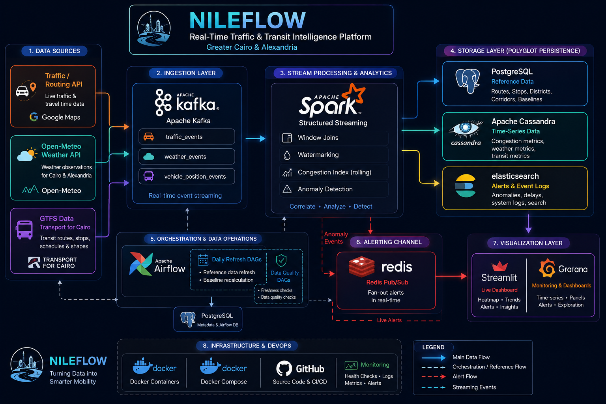

<!-- Header Banner — replace with your custom thumbnail -->
<p align="center">
  
</p>

<h1 align="center">
  NileFlow
</h1>

<p align="center">
  <strong>Real-Time Traffic & Transit Congestion Intelligence Platform for Greater Cairo and Alexandria</strong>
</p>

<p align="center">
  <a href="#-about"></a>
  <a href="#-tech-stack"></a>
  <a href="#-tech-stack"></a>
  <a href="#-tech-stack"></a>
  <a href="#-tech-stack"></a>
  <a href="LICENSE"></a>
</p>

<p align="center">
  <a href="#-about">About</a> &bull;
  <a href="#-problem-statement">Problem</a> &bull;
  <a href="#-solution">Solution</a> &bull;
  <a href="#%EF%B8%8F-architecture">Architecture</a> &bull;
  <a href="#-tech-stack">Tech Stack</a> &bull;
  <a href="#-getting-started">Getting Started</a> &bull;
  <a href="#-team">Team</a>
</p>

---

## About

**NileFlow** tells you, in real time, whether your commute through Cairo or Alexandria is about to be miserable — and *why*.

We stream live traffic, transit, and weather data through Kafka, process it with Spark Structured Streaming to compute a live congestion index, detect anomalies, and push alerts to Discord — while showing everything on a live map dashboard.

> Built as a capstone project for the **Digital Egypt Pioneers Initiative (DEPI)** — Data Engineering Track.

---

## Problem Statement

Greater Cairo's transportation network — a patchwork of formal metro and bus lines alongside informal microbus routes — has **no unified real-time information layer**.

- No public, data-driven view shows where the network is congested *right now*
- Traffic congestion is one of the most cited daily-life pain points in Egypt
- No open real-time analytics system combines **transit + traffic + weather** to explain how bad it is, where, and why

Commuters, city planners, and logistics companies are all flying blind.

---

## Solution

NileFlow bridges this gap by building a **real-time congestion and transit-delay monitoring platform** that:

- **Ingests** live traffic conditions, transit route data, and weather observations through Kafka
- **Processes** streams using Spark Structured Streaming — computing a rolling congestion index per corridor and detecting anomalies (sudden slowdowns, abnormal transit delays)
- **Stores** results across PostgreSQL, Cassandra, and Elasticsearch depending on data type
- **Visualizes** insights on a live, map-based dashboard
- **Alerts** via Discord webhook when severe congestion events are detected

---

## Architecture

<!-- Replace with your actual architecture diagram -->
<p align="center">
  
</p>

```
Data Sources ──► Kafka Topics ──► Spark Structured Streaming ──► Storage Layer ──► Dashboard + Alerts
                                                                      │
                                                            ┌─────────┼─────────┐
                                                        PostgreSQL  Cassandra  Elasticsearch
```

**Data Flow:**
1. **Kafka Producers** poll live APIs (traffic, weather) and generate synthetic vehicle position events
2. **Spark Structured Streaming** consumes all topics, applies windowed joins and watermarking
3. **Congestion Index** is computed per corridor (current travel time vs. baseline)
4. **Anomaly Detection** flags severe congestion or transit delay events
5. **Storage Layer** writes reference data to PostgreSQL, time-series metrics to Cassandra, and alert logs to Elasticsearch
6. **Redis Pub/Sub** fans out detected anomalies to the alert consumer
7. **Discord Webhook** posts formatted real-time alerts
8. **Live Dashboard** (Streamlit/Grafana) renders a congestion heatmap, time-series charts, and alert feed
9. **Airflow DAGs** handle daily reference data refresh, baseline recalculation, and data quality checks

---

## Tech Stack

<table>
  <tr>
    <th>Component</th>
    <th>Technology</th>
    <th>Purpose</th>
  </tr>
  <tr>
    <td><strong>Language</strong></td>
    <td></td>
    <td>All producers, Spark jobs, dashboard, and orchestration</td>
  </tr>
  <tr>
    <td><strong>Streaming</strong></td>
    <td></td>
    <td>Event streaming backbone — carries traffic, weather, and vehicle position events</td>
  </tr>
  <tr>
    <td><strong>Stream Processing</strong></td>
    <td></td>
    <td>Structured Streaming — windowed joins, congestion index, anomaly detection</td>
  </tr>
  <tr>
    <td><strong>Orchestration</strong></td>
    <td></td>
    <td>Daily reference data refresh, baseline recalculation, data quality checks</td>
  </tr>
  <tr>
    <td><strong>Relational DB</strong></td>
    <td></td>
    <td>Static reference data — routes, stops, corridors, districts</td>
  </tr>
  <tr>
    <td><strong>NoSQL / Time-Series</strong></td>
    <td></td>
    <td>High-throughput time-series storage for congestion and weather metrics</td>
  </tr>
  <tr>
    <td><strong>Search & Indexing</strong></td>
    <td></td>
    <td>Searchable alert and event history</td>
  </tr>
  <tr>
    <td><strong>Cache / Pub-Sub</strong></td>
    <td></td>
    <td>Real-time alert fan-out via pub/sub</td>
  </tr>
  <tr>
    <td><strong>Alerts</strong></td>
    <td></td>
    <td>Webhook-based real-time congestion alerts</td>
  </tr>
  <tr>
    <td><strong>Dashboard</strong></td>
    <td></td>
    <td>Live congestion map, time-series charts, and alert feed</td>
  </tr>
  <tr>
    <td><strong>Containerization</strong></td>
    <td></td>
    <td>Docker Compose runs the entire stack</td>
  </tr>
  <tr>
    <td><strong>Data Sources</strong></td>
    <td>
      
      
      
    </td>
    <td>Live traffic, weather observations, transit routes and schedules</td>
  </tr>
</table>

---

## Project Objectives

- Build a real-time, event-driven data pipeline using Apache Kafka
- Ingest live traffic, transit, and weather data from public APIs and open data sources
- Process streaming data with Spark Structured Streaming, including time-window joins
- Compute a real-time congestion index and detect anomalies (delays, slowdowns)
- Design a multi-database storage layer (PostgreSQL, Cassandra, Elasticsearch)
- Automate batch refresh and data quality checks using Apache Airflow
- Deliver real-time alerts through Discord webhook integration
- Build a live, map-based dashboard for congestion visualization

---

## Getting Started

### Prerequisites

- [Docker](https://docs.docker.com/get-docker/) & [Docker Compose](https://docs.docker.com/compose/install/)
- Python 3.11+
- API keys for Google Routes API (or self-hosted OSRM)

### Quick Start

```bash
# Clone the repository
git clone https://github.com/mohamed-mahmoud-de/NileFlow.git
cd NileFlow

# Start the full stack
docker-compose up -d

# Verify all services are running
docker-compose ps
```

### Project Structure

```
NileFlow/
├── producers/              # Kafka producers (traffic, weather, vehicle positions)
├── spark/                  # Spark Structured Streaming jobs
├── airflow/                # Airflow DAGs (refresh, quality checks)
├── dashboard/              # Streamlit/Grafana dashboard
├── alerts/                 # Discord webhook + Redis alert consumer
├── database/               # Schema definitions and init scripts
│   ├── postgres/
│   ├── cassandra/
│   └── elasticsearch/
├── config/                 # Configuration files
├── assets/                 # Images, diagrams, logos
├── docker-compose.yml      # Full stack orchestration
└── README.md
```

---

## Key Corridors Monitored

| Corridor | City |
|----------|------|
| Ring Road (Dائري) | Cairo |
| Corniche El Nil | Cairo |
| 6th of October Bridge | Cairo |
| Salah Salem Road | Cairo |
| 26th of July Corridor | Cairo |
| Alexandria Corniche | Alexandria |

---

## Team

<table>
  <tr>
    <td align="center"><strong>Mohamed Mahmoud</strong><br/><sub>Team Lead</sub></td>
    <td align="center"><strong>Alaa Elfaramawy</strong><br/><sub>Data Engineer</sub></td>
    <td align="center"><strong>Belquese Sahm</strong><br/><sub>Data Engineer</sub></td>
  </tr>
  <tr>
    <td align="center"><strong>Habeba AbdEldayem</strong><br/><sub>Data Engineer</sub></td>
    <td align="center"><strong>Mohamed Rifaat</strong><br/><sub>Data Engineer</sub></td>
    <td align="center"><strong>Yahya Galal</strong><br/><sub>Data Engineer</sub></td>
  </tr>
</table>

---

## Acknowledgements

This project is developed as a capstone for the **Digital Egypt Pioneers Initiative (DEPI)** — Data Engineering Track, under the supervision of the Ministry of Communications and Information Technology (MCIT), Egypt.

---

<p align="center">
  
  <br/>
  <sub>Built with data, for the streets of Cairo.</sub>
</p>
